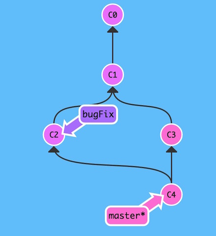
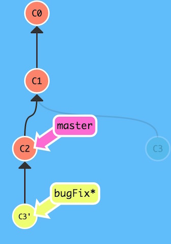

# Git 101
---
<http://pcottle.github.io/learnGitBranching/>

##git branch

	git branch newImage
So, master and newImage point to the same commit.  
But, you should switch to the `newImage` branch so as to commit on it.  
Switch using:
	
	git checkout newImage
Now, your commit will take effect on newImage.  
Or, a combination way:

	git checkout -b newImage

##git merge
 Merging in Git creates a special commit that has two unique parents(branch). Neither branch includes the entire set of "work" in the repository that we have done.  
 We will merge the branch `bugFix` into master. On `master`:
 
 	git merge bugFix
 `master` now points to a commit that has two parents. That means `master` contains all the work in the repository.   
   
 But branch `bugFix` remains the old status. Let's merge `master` into `bugFix`:
 
 	git checkout bugFix; git merge master
 Now `bugFix` and `master` point to the same commit.

## git rebase
The second way of combining work between branches is rebasing. Rebasing essentially takes a set of commits, "copies" them, and plops them down somewhere else.

While this sounds confusing, the advantage of rebasing is that it can be used to make a nice linear sequence of commits. The commit log / history of the repository will be a lot cleaner if only rebasing is allowed.

Assume that we have brances `master` and `bugFix`, now we're on `bugFix`:

	git rebase master
then:  
  

Now the work from our bugFix branch is right on top of master and we have a nice ***linear sequence*** of commits.  
Note that the commit C3 still exists somewhere (it has a faded appearance in the tree), and C3' is the "copy" that we rebased onto master.  
But `master` hasn't been updated either. 

	git checkout master
	git rebase bugFix
## Move around on your git tree
### HEAD
 HEAD is the symbolic name for the `currently checked out commit` -- it's essentially what `commit` you're working on top of.  
 Normally, HEAD attaching to the current branch and moved when the current branch commit, we can `detach` HEAD and `attach it to a commit` instead of a branch.
 
 	git checkout C1
 `C1`(commit hash) doesn't represent a branch but a commit.
### Relative Refs
In real Git world `C1` is a hash string like `fed2da64c0efc5293610bdd892f82a58e8cbc5d8`, you can use `git log` to see commit hashes. Git is smart about hashes, we can type `fed2` instead of the long string above.  
Specifying commits by their hash isn't the most convenient thing ever, which is why Git has relative refs.

* Moving upwards one commit at a time with `^`
* Moving upwards a number of times with `~<num>`

example:

	git checkout master^
	git checkout master~2
Way easier than typing the commit hash.  
You can also reference HEAD as a relative ref(`git checkout HEAD^`).   
You can directly reassign a branch to a commit with the `-f` option(branch forcing).

	git branch -f master HEAD~3

Moves (by force) the master branch to three parents behind HEAD.  

	git branch -f bugFix bugFix~3
Moves(by force) the bugFix branch to three parent behind itself.  
2点疑问：

* 能使用Ref，说明前面的版本没有多合一的情况，不然回溯会出现分支。（如果有多合一，被合的已经被删除了？只能用hash来使其复活？）
* 只有回溯的Ref，而没有前进的Ref。前进只能用`checkout + hash`的方式？

### Reversing changes(undo)
There are two primary ways to undo changes in Git -- one is using `git reset` and the other is using `git revert`. I think they take affect on **branches**.
#### git reset
`git reset` reverts changes by moving a `branch reference` backwards in time to an older commit. In this sense you can think of it as "rewriting history;" `git reset` will move a branch backwards `**as if the commit had never been made** in the first place.
#### git revert(到底干啥用的？)
While reseting works great for local branches on your own machine, its method of "rewriting history" doesn't work for remote branches that others are using.

In order to reverse changes and **share those reversed changes with others**, we need to use `git revert`.   
