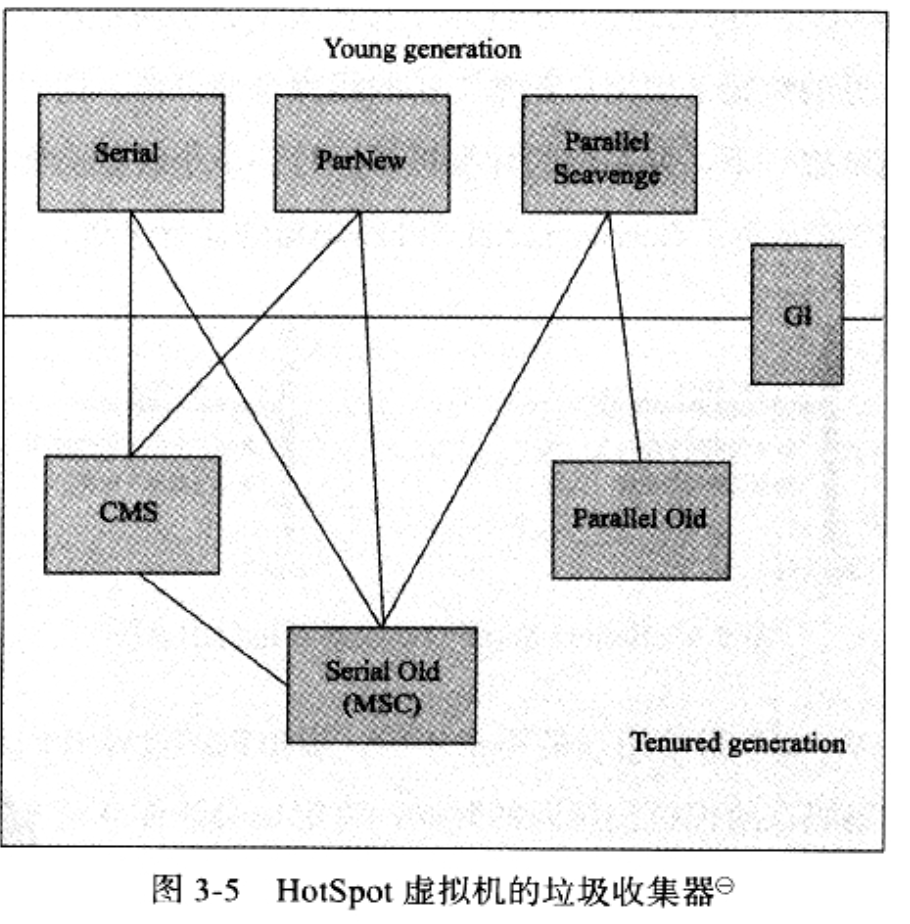

# 《JVM高级特性与最佳实践》读书笔记
---
## 运行时数据区域
### 线程隔离的数据区（线程私有的，但是是否多个线程的数据区都放到一个地方？比如有一个程序计数器区，里面分线程放置多个程序计数器。）
#### 程序计数器
每个线程都需要一个独立的程序计数器。记录当前线程执行的字节码的行号。“线程私有的内存”。和CPU的计数器相似。如果线程正在执行一个java方法，计数器记录的是虚拟机字节码指令地址；如果正在执行native方法，计数器值为空。该区域为JVM规范中唯一没有规定OOM情况的区域。
#### JVM栈
描述的是Java方法执行的内存模型，每个***方法***执行时都会创建一个Stack Frame，记录局部变量表、方法出口、动态链接等信息。  
每个方法从调用到执行完成，对应一个Stack Frame在JVM栈入栈到出栈过程。  
一般人们粗糙地说“栈、堆”里面的栈就是指这个的局部变量表。局部变量表所需空间大小在编译时就已经确定，运行时不会改变。64位的long和double会占用2个局部变量空间（slot），其他都是一个。
JVM规范中对该区域规定了2个异常：
	* StackOverFlowError: 线程请求的栈深度大于虚拟机允许的栈深度。
	* OOMError：大部分JVM栈都可动态扩展，当扩展时无法申请到足够内存时发生。

用`-Xss128k`来限制。
#### Native Method 栈
与JVM栈作用类似，只是为JVM使用到的本地方法服务。有的虚拟机（如HotSpot）甚至把它与JVM栈合二为一。也会抛SOF和OOM。

### 线程共享的数据区
#### Java Heap
JVM启动时创建。存放对象实例。它是GC的主要区域。`-Xms200M -Xmx200M`就是它。它的分配详情再讨论。
#### Non-Heap（非堆，方法区）
放JVM加载的类信息、常量、静态变量、编译后的代码等。JVM规范描述为堆的一个逻辑部分。HotSpot采用GC永久代的方法管理这个区。永久代有`-XX:MaxPermSize`的限制。可用`-XX:PermSize=128M`和`-XX:MaxPermSize=200M`限制。
#### 运行时常量池（方法区的一部分）
存放编译时生成的各种字面量和符号引用。另外它还是动态的。运行时也可将新的常量放入，如String类的intern（）方法。
#### 直接内存（Direct Memory）
JDK1.4中引入的NIO类，基于channel和Buffer的I/O方式，可用Native库直接分配堆外内存，然后利用一个存储在堆中的DirectByteBuffer对象作为这块内存引用来操作。避免了在Java堆和Native堆中来回复制数据。
## 对象的创建、访问定位、内存布局（暂缓）
### 对象内存布局
分为对象头（对象GC代、运行信息、对象类型指针等）、实例数据（父类对象和自己字段内容）、对齐填充。
### 杂记
String.intern()方法，是个Native方法，作用是，如果字符串常量池已经包含一个等于此String的字符串，则返回该字符串，如果没有，则复制该字符串到常量池（JDK1.6以下），因此这个intern方法返回的字符串肯定是常量池里的一个字符串。如果是1.7以上，则是，如果常量池已经有，和1.6一样；如果没有，则在常量池中记录该字符串的引用（不复制到常量池，引用指向的还是堆上的这个字符串）。
## 第三章 GC和内存分配策略
### 如何确定对象已死？
引用计数？微软的COM、Flash Player的AS、Python采用的，但是主流的JVM却没采用。因为如果A引用B，B引用A，其他人都不要他们了，但它们的计数还是1.  
***可达性分析（reachability Analysis）***：Java、C#等语言采用。从一系列称为GCRoot的对象开始，如果有到某对象的通路，则该对象可用。路径叫做引用链（Reference Chain）。Java中的GCRoot对象包含下面几种：
	* JVM栈中（本地变量表）引用的对象。
	* 方法区中类静态属性、常量引用的对象。
	* 本地方法中JNI（一般说的Native方法）引用的对象。
JDK1.2之后对引用扩充为下面4种，强度由强到弱：
	* 强引用
	* 软引用：非必需引用，在将要发生内存溢出前，把这类引用列入回收范围。1.2后提供了SoftReference类来实现。
	* 弱引用：非必需引用，这类引用只能活到下次垃圾收集之前。1.2后提供了WeakReference类来实现。
	* 虚引用：只是这个引用在被收集时收到一个系统通知，没啥。。
### 它是怎么死的？
其实一个对象被判不可达之后，并非“非死不可”：如果它覆盖了`finalize（）`方法，且该方法没被调用过，则会被放入一个`F-Queue`队列（else 就直接被回收），并`稍后`由一个`低优先级`(不确定性根源)的finalize线程去执行这个方法，但是不一定会等这个方法执行结束哦，因为这些finalize方法如果包含死循环队列就堵住了。。在finalize方法里对象可自我救赎，比如把自己（this）赋给一个实例的成员变量，那么就逃脱了！但是这个自救方法之能执行一次，因为系统只会调一次你的finalize方法！  
所以这个方法只是对C++程序员的妥协，代价高昂，不确定性大，无法保证各个对象的调用顺序。它做的工作finally都能做的更好，还是忘了它吧。
### 方法区回收
方法区的常量、类回收的性价比不高，包括废弃常量和类的回收，类的回收条件苛刻，而且不一定是满足类回收条件就回收，HotSpot提供了`-Xnoclassgc`参数进行控制。在大量使用反射、动态代理，OSGi这类频繁调用自定义ClassLoader的场合需要JVM具有类卸载功能。
### GC算法－－方法论
简单介绍算法发展及思想。
#### 标记－清除算法（Mark－Sweep）
	1. 标记要回收对象。
	2. 统一回收标记对象。  
缺点：
	1.效率低。
	2.易产生碎片。
其他算法基本都是基于它的改进。
#### 复制算法
将内存分为对等2份，每次只使用一份。当这一份内存占满时（需要GC），把还存活的对象复制到另一份上，清空这一份。现代商用JVM都采用这一方法回收新生代。
	1. 运行高效，实现简单，无需考虑内存碎片等情况。
	2. 代价是内存缩小为以前一半。。。
研究表明新生代中98%的对象都是朝生夕死的，所以，HotSpot将内存分为一块较大的`Eden`（i：dn，伊甸）和2块较小的`Survivor`，每次使用Eden和一块Survivor，回收时把活着的对象都复制到另一块Survivor上。默认Eden和Survivor大小为`8:1`，因此每次只浪费10%空间。如果放不下的话。。。可用借用其他内存分配担保。
#### 标记－整理算法
老年代一般不用复制算法，1是浪费空间，2是为了应对100%都存活的极端状况。。根据老年代特点，改进“标记－清理”算法，标记还是一样，然后把所有存活对象往内存一端移动（消除碎片）。
#### 分代算法
现代商用JVM采用，就是根据对象存活周期将内存划为几块，一般分为新生代和老年代，然后根据不同代特点选用不同算法。新生代用复制算法，老年代由于存活率高，内存小，用标记－整理或者清理算法。
### HotSpot的算法实现
#### 枚举GC Root
方法区、Heap里Root对象太多，分析的时候需要停顿所有Java线程，怎么办？事实是无需枚举所有Root，而是用一组叫OopMap的数据结构来在编译时记录哪些位置是引用，扫描时直接找到了。
#### SafePoint
但是可能导致引用变化的指令很多，不可能为每条指令都生成Oomap，额外空间很大。so，只在“关键位置”（safePoint）记录信息，程序只在安全点停下来GC。让线程都跑到安全点停下来，这个一般选用`主动式中断`。即简单设置一个标志，线程轮询标志，发现为真时就停下来。
#### SafeRegion
有的线程处于sleep或者block状态无法走到安全点。。怎么办？安全区是指一段代码片段中，引用关系不会发生变化。在这段代码的任意位置都可以开始GC（好像是扩展的安全点）。当线程运行到Region时，标记自己进入安全区，JVM要进行GC时不管标记为进入安全区的线程。线程离开Region时也要检查GC是否完成Root枚举或者完全完成，没完成再等会。
### 垃圾收集器－－具体实现
#### 1. Serial GC
新生代，采取`复制算法`，收集时暂停所有用户进程。
	* 简单高效，单CPU没有线程交互开销。
	* 若一次收集一两百M新生代，也能在几十毫秒完成，适用内存较小桌面应用JVM。  
#### 2. ParNew GC
算法和Serial GC一样，只是在新生代收集上，变成了`多线程`。老年代似乎和Serial GC一样？
	* 适用多核CPU。
	* 除了Serial Old GC外，只有它能和CMS（一个老年代GC）共同工作。
#### 3. Parallel Scaverage GC
是一个新生代GC，看上去和ParNew一样，特点是：
	* 关注点不同。其他GC是缩短GC时用户线程停顿时间（这个对需要交互的程序比较重要）。它的目标是达到一个可控吞吐量（Throughput）。即用户代码运行时间占（用户代码运行时间和GC占用时间）比例。它的目标是`高效完成运算任务`，适合在后台运行不需太多交互的任务。
	* 两个参数：`-XX:MaxGCPauseMillis`控制最大GC停顿时间（大于0的毫秒数）。`-XX:GCTimeRatio`直接设置吞吐量大小（1-99的整数）。垃圾收集时间占比为：1/(1+TimeRatio)，默认是99，即GC时间占比为1%。
	* 自适应内存分配策略`-XX:UseAdaptiveSizePolicy`打开后，只需设置`-Xmx`最大堆等基本参数，然后设置上面的两个参数中的一个作为优化目标，GC会自动调节新生代大小，Eden与Survivor区的比例等。 
#### 4. Serial Old GC
`这是介绍的第一个老年代GC`下面都是老年代GC。  
Serial GC的老年代版本，同样是单线程的，采用`标记－整理算法`，主要给Client下的JVM使用。在Server下有2个用途：
	* 在JDK1.5之前搭配Parallel GC使用。
	* 作为CMS GC后备方案，在其CMF`Concurrent Mode Failure`时使用。
#### 5. Parallel Old GC
Parallel Scaverage GC的老年代版本，并与之配合使用。老年代采用并行的`标记－整理算法`。在JDK1.6之后才出现的（上面说1.5之前P Scaverage只能与Serial Old搭配）。
#### 6. CMS(Concurrent Mark－Sweep) GC
目标是获取最短收集停顿时间（这样可能占用的CPU时间就较多，对CPU资源敏感）。它分为4段：
	* 初始标记。（暂停用户线程，快）
	* 并发标记。（和用户线程一起执行，并发，慢）
	* 重新标记。（暂停用户线程，多线程，较快）
	* 并发清除。（和用户线程一起执行，并发，慢）  
因为边处理垃圾用户进程边丢，所以有这些“浮动垃圾”的存在，容易导致CMF。另外因为它和用户进程一起工作，需要预留部分内存给用户进程，如果这部分内存不能满足用户，也会CMF。此时会启动`Serial Old GC`来收集，停顿时间就很长了。  
还有个缺点是，由于采用`标记－清除算法`，易产生碎片。为此CMS默认开启一个`-XX:+UseCompactAtFullCollection`，用于在CMS顶不住要Fu 来了GC时，开启碎片合并整理。  
`CMS和Parallel Scaverage不能搭配使用!`，估计那货是吞吐量优先的原因。
#### 7. G1（Garbage First）
JDK1.7u14 之后可商用的，它的特点是：
	* 把内存划分成多个Region，化整为零，在局部看是复制算法，整体是标记－整理算法。
	* 分代收集。
	* 并行与并发。
	* 可预测停顿。（重要）除了追求低停顿，还能建立可预测的停顿时间模型，让用户明确指定在一段时间里消耗在GC的时间不能超过N毫秒。
	*  吞吐量自然打点折扣。
随着Oracle的持续改进，G1会越来越好吧。
下面来一张HotSpot的GC全家福，连线指`可以搭配的GC`。  

#### GC日志含义&常用GC参数（见原书）
略.可以看出使用的是什么GC、GC的时间点、是否是主动调用System.GC()产生的GC（包含SYSTEM字样），GC前后占用内存大小、GC的是哪个区（新生代、老年代）等。
#### 内存分配与回收策略
Java的内存自动管理归结为内存自动分配和自动回收2个问题。
