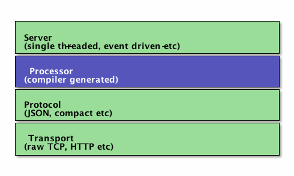

# Thirft 编写Java RPC
---
<http://wiki.apache.org/thrift/FrontPage>  
当然Thrift不仅仅能写Java程序之间的RPC，它是跨语言的。我这里只用到了Java。
## Apache Thrift 

Apache Thrift is a software framework for **scalable cross-language services** development. Apache Thrift allows you to **define data types and service interfaces** in a simple **definition file**. Taking that file as input, **the compiler generates code** to be used to easily **build RPC clients and servers** that communicate seamlessly across programming languages.


## Features
原理请看： [Thrift白皮书][idx1]  

### 支持的Features
* 接口描述语言（IDL）：都在这个IDL文件里定义。
* 支持多种语言绑定：C/C++/Java/Python/PHP/C#/JS/...
* namespace：每个Thrift文件都在自己的namespace里，不同文件内的标识符可相同。
* base types：只有几个基础类型（稍后介绍）。
* 结构体：用结构体来表示一堆关联数据。
* 容器：可以使用 List/Map/Set这类容器，容器里的元素可以是任何基础类型和结构体，但一个容器里的元素类型必须是相同的。
* 结构演进：添加、删除字段不会对已有客户端产生影响，因为Thrift用整数标识符来标记字段。
* services：一组function的集合。service继承：拥有父service的所有功能并可以有自己新加的function。
* 异步调用：不需要返回值的函数可以异步调用，这样client不会阻塞来等待server处理完。
* 异常：function还能抛异常。

### 不支持的Features

* struct循环引用自己：只能引用本struct之前定义的东西。
* struct继承、多态、**重载**（一个service里的方法**命名唯一**）。
* 不能返回null


## Thrift使用流程
1. 编写IDL文件。
2. 用thrift编译器编译IDL文件，生成对应的语言代码文件。
3. 在你的程序中引入这些代码文件（java需要引入`libthrift`包）。
4. 实现这些代码文件中的接口（你所定义的RPC方法，当然只用在Server端实现，Client根据这些接口来调用），并按照Thrift服务端流程、客户端流程编写程序即可。

## IDL文件编写
IDL文件格式描述见：<http://thrift.apache.org/docs/idl>  
or:[Thrift_IDL.md](Thrift_IDL.md "IDL")
结尾有一些IDL示例。  

下面的示例IDL文件，包含一个带返回数据类型的方法。

```
#用"thrift-0.9.2.exe -gen java x.thrift"命令编译该文件，生成java的代码
#指定生成后每种语言的namespace
namespace java com.test.service.thrift 
namespace py service.thrift

struct TH_ProxyEntity {
1: bool needpwd,
2: string host,
3: i32 port,
4: string username,
5: string passwd
}
#RPC方法声明，返回一个实例
service TH_ProxyService { 
TH_ProxyEntity getProxy(1:string host)
}
```

### Java数据类型对应

```
/**
 * The first thing to know about are types. The available types in Thrift are:
 *
 *  bool        Boolean, one byte
 *  byte        Signed byte
 *  i16         Signed 16-bit integer - short
 *  i32         Signed 32-bit integer - int
 *  i64         Signed 64-bit integer - long
 *  double      64-bit floating point value - double
 *  string      String
 *  binary      Blob (byte array)
 *  map<t1,t2>  Map from one type to another
 *  list<t1>    Ordered list of one type
 *  set<t1>     Set of unique elements of one type
 */
```

可以在idl里定义：`typedef i32 int`，可以按java的习惯写了。

## 编译IDL文件

对于windows，下载对应版本的Thrift compiler，我这里是`thrift-0.9.2.exe`，对IDL文件进行编译（参数可参考`--help`），示例：

	thrift-0.9.2.exe -gen java x.thrift
	thrift-0.9.2.exe -gen py x.thrift

代码生成在对应的`gen-java`等目录。

如果使用Linux开发，需要先编译Thrift源码，生成Thrift compiler，因为有一些依赖稍微有点复杂。

## Java中编写Thrift程序

引入生成的gen-java中的java文件到你的工程里。  
下面是Thrift的网络栈[【参考这里】][idx3]。服务端、客户端的编写过程和这个有点关系。



服务端和客户端的程序有以下几种[【参考这里】][idx2]：

* S1:TSimpleServer(阻塞IO，一般测试用)
* S2:TThreadPoolServer(阻塞IO，线程池模式，和S1通道什么都一样，创建Server时不一样)
* S3:非阻塞IO，TNonblockingServer,TThreadedSelectorServer
* S4:THsHaServer(半同步半异步模式，和S3其他地方都一样，创建Server时不一样，S3、S4通道需要指定TFramedTransport)

* C1:TTransport为TServerSocket的，能连接S1、S2
* C2:TTransport为TFramedTransport，能连接S3、S4
* C3:AsyncClient，采用AsyncCallback等，能连接S3（S4没测试过，应该也可以的）

下面展示了阻塞IO线程池方法的Server和Client：
### 服务端程序

Server步骤：

1.  创建一个transport对象
2.  为transport对象创建输入输出protocol
3.  基于输入输出protocol创建processor
4.  等待连接请求并将之交给processor处理

```
		//1.设置传输通道，普通通道
		TServerTransport serverTransport = new TServerSocket(bindAddress);//这里会尝试绑定
		//2.使用高密度二进制协议
		TProtocolFactory proFactory = 
				new TCompactProtocol.Factory();
//				new TJSONProtocol.Factory();
//				new TBinaryProtocol.Factory();
//				new TTupleProtocol.Factory();
		//3.设置处理器
		TProcessor processor = new TH_ProxyService.Processor<Iface>(new PServiceImpl());
		
		//4.创建服务器
		 server = new TThreadPoolServer(
				new Args(serverTransport)
				.protocolFactory(proFactory)
				.processor(processor)
			);
```

### 客户端程序

```
	// 1.设置传输通道 - 普通IO流通道
		TTransport transport = new TSocket("localhost", 7911);
		transport.open();
		
		//2.使用高密度二进制协议，与服务端一致
		TProtocol protocol = new TCompactProtocol(transport);
		
		//创建Client
		TH_ProxyService.Client client = new TH_ProxyService.Client(protocol);
		//调用方法，这是一个带返回值的方法
		TH_ProxyEntity e =  client.getProxy("2aidu.com");
		transport.close();
```

[idx1]: http://thrift.apache.org/static/files/thrift-20070401.pdf "Thrift whitepaper"
[idx2]: http://www.micmiu.com/soa/rpc/thrift-sample/
[idx3]: http://jnb.ociweb.com/jnb/jnbJun2009.html