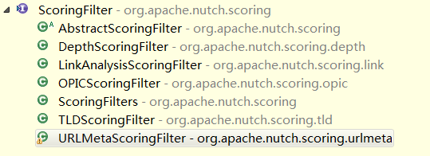

# Plugins
插件是Nutch实现定制化可配置裁剪的一个重要机制。
---
## 插件列表

* **Protocol**插件：对url进行抓取并返回内容。
* **ScoringFilter**插件：对网页进行评分。
* **URLFilter**插件：对url进行过滤。


## Protocol插件
`Protocol`插件是Nutch在`Fetch`阶段用来获取网页的插件，Nutch1.9实现了`ftp、file、http、httpclient`4种。后两个是网页抓取用的。httpclient用的是`Commons HttpClient 3.x`，已经不被支持了。我们先看Protocol插件的源码，最后会增加一个自己的Protocol来抓取网页，使用httpclient4。  
### 相关数据结构

#### Protocol接口

	/** A retriever of url content.  Implemented by protocol extensions. */
	public interface Protocol extends Pluggable, Configurable 
从注释我们可以看出，这个接口功能是获取URL的网页内容，所有Protocol插件扩展都需要实现这个接口。他的一个主要方法：

```
  /** Returns the Content for a fetchlist entry.
   */
  ProtocolOutput getProtocolOutput(Text url, CrawlDatum datum);
```

把抓取到的内容、状态信息等打包到ProtocolOutput里返回。

#### ProtocolOutPut类
ProtocolOutPut类里包含2个变量：


```
  private Content content;//抓取到的内容封装
  private ProtocolStatus status;//状态信息
```

每个变量包含的内容如下：


```
//Content类的成员变量，之前Fetcher阶段说的Content就是它
  private String url;

  private String base;//该URL由谁衍生来的（如果该URL是generate阶段产生的，则同url变量（看↑那个变量），Fetcher阶段并不仅仅抓取generate生成的URL，也会根据配置继续extract链接抓取，被extract处理的URL如果立马被抓取，则它的base和url变量就不同了）

  private byte[] content;

  private String contentType;

  private Metadata metadata;

  private MimeUtil mimeTypes;

//ProtocolStatus类成员变量，主要包含一个状态码、参数列表
  private int code;
  private long lastModified;
  private String[] args;
```

#### HttpBase
Nutch1.9用一个插件`lib-http`封装了http抓取的一些公共内容。包括HTTP异常类，`HttpRobotRulesParser`(Robots文件解析)，以及一个抽象类`HttpBase`来定义一些基础变量、公用 conf设置（如一些http插件和httpclient插件都一样的东西，一些请求头配置，代理）等。  
 Protocol的主要插件都继承自`HttpBase`，会省很多事。我们之后也决定继承它来获得一些便利。

	public abstract class HttpBase implements Protocol 

该抽象类实现了Protocol的`getProtocolOutput`方法，但是并不打算让它的子类覆盖它，因此它为子类留了一个抽象方法：

```
  protected abstract Response getResponse(URL url,
                                          CrawlDatum datum,
                                          boolean followRedirects)
    throws ProtocolException, IOException;
```
子类只需要覆盖这个方法，返回要求的`Response`让`HttpBase`在`getProtocolOutput`方法里处理即可，`HttpBase`在该方法里，会对`Response`的状态码进行判断，封装`ProtocolOutPut`，交给上层的`Fetcher`处理。  
而`Response`是一个接口，定义如下：

```
 /** Returns the URL used to retrieve this response. */
  public URL getUrl();

  /** Returns the response code. */
  public int getCode();

  /** Returns the value of a named header. */
  public String getHeader(String name);

  /** Returns all the headers. */
  public Metadata getHeaders();
  
  /** Returns the full content of the response. */
  public byte[] getContent();
```

可以看出是抓取结果的一个包装。  
下面情况就明朗了，我们的插件**应该**：  

1. 定义一个`Http`类继承`HttpBase`，因为它有`Protocol`接口(Protocol插件必需)。
2. `Http`类需要实现`getResponse`方法，该方法抓取url，并返回一个 实现了`Response`接口的对象。
3. 定义一个实现`Response`接口的类`HttpResponse`。

编写插件的时候应该注意，`getProtocolOutput`方法会被每个抓取线程所调用，因此该方法调用的所有方法都要注意**线程安全**问题，尽量避免对线程共享变量进行写操作之类的场景（一个插件可能使用一个HttpClient来进行抓取，这时候由HttpClient来保证线程安全）。

## ScoringFilter插件
`Scoring`是Nutch对网页进行评分的机制，网页的评分在搜索索引建立和`generate`等阶段均有使用。Nutch通过`ScoringFilter`插件对网页进行评分，并将分数反映在`CrawlDatum`里的score变量上。在Nutch的生命周期多个阶段，该插件都有调用。  
评分插件依然采用链式的插件调用机制，各评分插件需要实现`ScoringFilter`接口。`ScoringFilters`用来创建和缓存这些评分插件，并提供循环调用评分插件的方法。  
### Nutch中ScoringFilter插件出现和起作用的地方
#### Injector
在`injector`阶段，我们可以在种子文件中配置种子url的初始scores，如果未配置则默认是`1.0f`。
#### Generator
`ScoringFilters`插件在`Generator.Selector`类中使用，对每一个url执行Score插件的`generatorSortValue `产生一个排序值，然后从高到低选择前N个url进行抓取。

Nutch中其他使用到`ScoringFilters`插件的地方：

* ./src/java/org/apache/nutch/crawl/CrawlDbReducer.java
* ./src/java/org/apache/nutch/indexer/IndexerMapReduce.java
* ./src/java/org/apache/nutch/parse/ParseOutputFormat.java
* ./src/java/org/apache/nutch/parse/ParserChecker.java
* ./src/java/org/apache/nutch/parse/ParseSegment.java
* ./src/java/org/apache/nutch/tools/arc/ArcSegmentCreator.java
* ./src/java/org/apache/nutch/tools/FreeGenerator.java


#### ScoringFilter接口
 	A scoring filter will manipulate scoring variables in CrawlDatum and 
	in resulting search indexes. Filters can be chained in a specific order, 
	to provide multi-stage scoring adjustments.

从接口的注释中我们可以看到，评分插件主要影响到`CrawlDatum`中的`scoring`变量，并且在`solr`进行索引时会有用。评分插件可以链式调用。  
接口的方法如下，不同的方法会在Nutch流程不同的地方被调用（至少在下面的过程中被调用，对应方法序号：1inject，2fetch，3generate，4fetch后parse前，5parse后，6parse后，7updatedb，8index）。

>
> 1. 给Injector注入的种子URL设置初始分数（非0，一般是1）,`Injector`阶段调用。  
`public void injectedScore(Text url, CrawlDatum datum) throws ScoringFilterException;`
> 2. 设置一个从已抓取网页中析出的URL的初始分数（可以为0，因为该URL会继承它的入链的部分分数。  
  `public void initialScore(Text url, CrawlDatum datum) throws ScoringFilterException;`
> 3. 给URL产生一个排序值，以对URL进行排序，取**TopN**进行抓取在`generate`阶段调用。  
  `public float generatorSortValue(Text url, CrawlDatum datum, float initSort) throws ScoringFilterException;`
> 4. 把CrawlDatum里有关`scoring`的所有`MetaData`传递给改CrawlDatum的Content，供其对抽取的OUTLINKS评分使用，在解析OUTLINKS之前调用（Fetch阶段）。  
 `public void passScoreBeforeParsing(Text url, CrawlDatum datum, Content content) throws ScoringFilterException;`
> 5. 把该`CrawlDatum`解析阶段产生的`score`信息传递到解析之后的`parse`变量的`MetaData`里去。  
  `public void passScoreAfterParsing(Text url, Content content, Parse parse) throws ScoringFilterException;`
> 6. 把`score`信息从当前`CrawlDatum`传递到它的析出链接OUTLINKS中。  
   **@param parseData** 该URL的`ParseData`实例，插件可以修改其内部评分并持久化。  
   **@param targets** 插件可以修改其内部评分并持久化。  
   **@param adjust** 一个`CrawlDatum`实例，初始化为null，插件可以调整原始`CrawlDatum`的评分，并返回一个包含调整后的`CrawlDatum`（该方法的return参数，因此这个参数似乎没必要）。  
   **@param allCount** 所有OUTLINK的数量。  
   **@return** if needed, implementations may return an instance of CrawlDatum, with status `CrawlDatum.STATUS_LINKED`, which contains adjustments to be applied to the original CrawlDatum score(s) and metadata. This can be null if not needed.  
   `public CrawlDatum distributeScoreToOutlinks(Text fromUrl, ParseData parseData,
          Collection<Entry<Text, CrawlDatum>> targets, CrawlDatum adjust,
          int allCount) throws ScoringFilterException;`
> 7. 在`CrawlDb update`阶段，计算一个`CrawlDatum`的新`score`，计算依据是`old original datum`和`inlinked`，最后放入`the new datum`里，这个datum最后会存入`crawldb`。如果`old original datum`不存在，则用datum里的值和`inlinked`来计算（具体的计算逻辑可以不同，大体就是old和inlink计算出来了新的score，放入datum）。  
   **@param `old original datum`**, 当前`crawldb`里读取到的该URL的`CrawlDatum`，如果是新的URL，那么这个是null。  
   **@param datum `the new datum`**, 从generate阶段产生的`CrawlDatum`，这个datum经历了`generate->fetch->parse`这些阶段，最后它的状态不是db的状态（`datum.status > STATUS_DB_MAX`，是`fetch`的一个状态）存在于segments目录里一个segment下的`crawl_parse`目录。最后会用`old original datum`来更新它，最终将它存入`crawldb`。它的值可能不是有效的，因为有可能其他的segment在该datum所属segment进行`UpdateDB`之前先进行了该操作。  
   **@param inlinked** 当前发现的所有指向该`CrawlDatum`的`CrawlDatum-s`。  
  `public void updateDb core(Text url, CrawlDatum old, CrawlDatum datum, List<CrawlDatum> inlinked) throws ScoringFilterException;`
> 8. 计算`Lucene document boost`，它出现在`Solr indexing job`阶段，在处理完NutchDocument文档最后，给每个文档计算该值。  
   **@param `doc Lucene document`**. 插件可以在交给solr索引前改变它的内容，最后存的是它。  
   **@param `dbDatum`** `crawldb`里的该URL的`CrawlDatum`。  
   **@param `fetchDatum`** 同`updateDbScore`里那个`the new datum`。  
   **@param initScore** initial boost value for the Lucene document.  
   `public float indexerScore(Text url, NutchDocument doc, CrawlDatum dbDatum,
          CrawlDatum fetchDatum, Parse parse, Inlinks inlinks, float initScore) throws ScoringFilterException;`

### Nutch中已有的`ScoringFilter`
Nutch中已经实现了几个评分插件如下图：  


#### `DepthScoringFilter`
限制URL从初始种子开始计算的深度，如果一个URL的深度**大于等于**默认最大深度或者Nutch配置文件里设定的允许最大深数（`scoring.depth.max`），则该URL的所有**OUTLINKS**会被抛掉。使用该插件，会在`CrawlDatum`的`MetaData`里记录该`CrawlDatum`所属的深度`_depth_`和允许的最大深度`_maxdepth_`。  
该插件对`generate`阶段URL排序分数影响：
	插件处理后分数 = 处理前分数 * (1 + (允许最大深度 - 当前URL深度));//允许最大深度如未指定默认为1000
其他地方只是对深度的修改，不涉及分数处理。

#### `OPICScoringFilter`-在线网页重要度计算
This plugin implements a variant of an **Online Page Importance Computation (OPIC) score**//, described in this paper: [【Abiteboul, Serge and Preda, Mihai and Cobena, Gregory (2003), Adaptive On-Line Page Importance Computation】](http://www2003.org/cdrom/papers/refereed/p007/p7-abiteboul.html)   

* `initialScore`   
初始化score为`0.0`。因为析出的每个URL都有至少一个入链，会继承分数。
* `generatorSortValue`   
`排序分数 = CrawlDatum内分数 * 排序初始分数`
* `updateDbScore(Text url, CrawlDatum old, CrawlDatum datum, List<CrawlDatum> inlinked)`   
更新datum的分数为，old的分数+（所有inlink的分数总和）
* `passScoreBeforeParsing(Text url, CrawlDatum datum, Content content)`  
把datum的分数存入content的Meta信息里: `content.getMetadata().set(Nutch.SCORE_KEY, "" + datum.getScore())`
* `passScoreAfterParsing(Text url, Content content, Parse parse)`  
把content里的分数存入parse里: ` parse.getData().getContentMeta().set(Nutch.SCORE_KEY, content.getMetadata().get(Nutch.SCORE_KEY))`
* **`distributeScoreToOutlinks(Text fromUrl, ParseData parseData, Collection<Entry<Text, CrawlDatum>> targets, CrawlDatum adjust, int allCount)`**  

