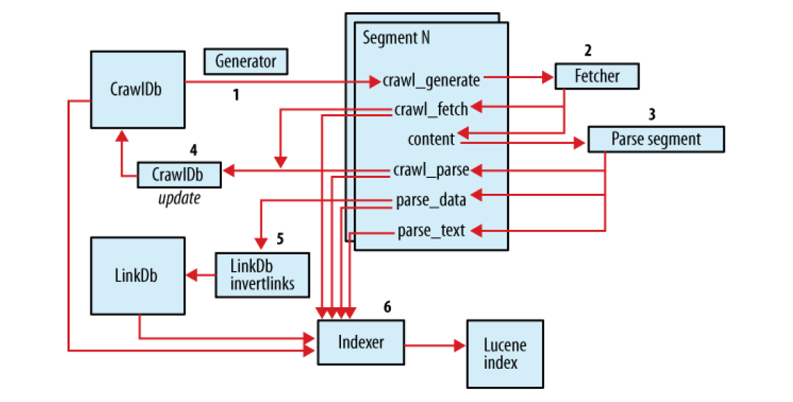

# Nutch1.9源码解析
---
## 概述
这是本人学习Nutch源码的一点心得和笔记，希望能在看源码的过程中，总结到爬虫各个关键问题的处理方法。在学习的过程中参考了<http://blog.csdn.net/spacewalkman/>的”Nutch源码分析“系列文章。

Nutch是Doug Cutting发起的爬虫项目（刚开始是搜索引擎，后来发展为专注爬虫），基于HDFS和Hadoop框架，事实上HDFS和Hadoop就是因为这个项目而被写出来的。 

Nutch1.x版本的后端存储是HDFS，2.x版本把存储层抽象了出来，通过Gora实现了多后端存储，可以把结果存储在nosqldb/关系数据库等不同类型的存储系统上。2.x版本还把URL过滤、索引去重等公共模块抽取出来了，可以直接用在自己的爬虫上。抽取上，只是抽取出NutchDocument，然后索引、搜索的功能交给第三方做，更专注爬取功能。还有RESTFUL接口等功能<sup>[NutchRoadMap](http://wiki.apache.org/nutch/Nutch2Roadmap)</sup> 。

我们先从1.x看起。
## Nutch工程引入
nutch采用ant编译，使用ivy管理项目依赖。安装ant之后，在nutch根目录下执行`ant eclipse`生成eclipse所需要的`.classpath和.project`文件；或者执行`ant deploy`会生成maven项目，会在nutch的根目录下生成pom文件。  
注意：nutch的plugin项目并没有在生成的pom里配置，因此用maven的话不太爽，我用的是生成.project文件那种方式，然后导入到eclipse里<sup>[[reference]](http://blog.csdn.net/spacewalkman/article/details/41700593)</sup>。
## 流程和中间目录
### 流程图
Nutch的爬取流程由一个个MR程序构成，而驱动这个流程的是`./bin`目录下的脚本`nutch`和`crawl`，nutch脚本里定义了爬取流程的每一步需要调用的MR程序，而crawl脚本负责调用nutch，把这些步骤串起来。 建议先读一下这2个脚本的代码，会对Nutch的工作流程有一个大概的认识。
  
注意，标数字的代表nutch的处理过程（流程图里应该用非正方形的平行四边形表示），其他是存储的表示（比如CrawlDb指的是存储URL相关的文件）。“1、2、3、4”是Nutch爬取的circle，5、6等是为搜索引擎准备的索引和链接关系分析模块。  
注意Inject这个过程在这个图里没有画出来，它是Nutch第一次启动时候，向crawldb库里注入初始种子链接用的。  

nutch脚本内的命令列表：

```
 echo "Usage: nutch COMMAND"
  echo "where COMMAND is one of:"
  echo "  readdb            read / dump crawl db"
  echo "  mergedb           merge crawldb-s, with optional filtering"
  echo "  readlinkdb        read / dump link db"
  echo "  inject            inject new urls into the database"
  echo "  generate          generate new segments to fetch from crawl db"
  echo "  freegen           generate new segments to fetch from text files"
  echo "  fetch             fetch a segment's pages"
  echo "  parse             parse a segment's pages"
  echo "  readseg           read / dump segment data"
  echo "  mergesegs         merge several segments, with optional filtering and slicing"
  echo "  updatedb          update crawl db from segments after fetching"
  echo "  invertlinks       create a linkdb from parsed segments"
  echo "  mergelinkdb       merge linkdb-s, with optional filtering"
  echo "  index             run the plugin-based indexer on parsed segments and linkdb"
  echo "  dedup             deduplicate entries in the crawldb and give them a special status"
  echo "  solrindex         run the solr indexer on parsed segments and linkdb - DEPRECATED use the index command instead"
  echo "  solrdedup         remove duplicates from solr - DEPRECATED use the dedup command instead"
  echo "  solrclean         remove HTTP 301 and 404 documents from solr - DEPRECATED use the clean command instead"
  echo "  clean             remove HTTP 301 and 404 documents and duplicates from indexing backends configured via plugins"
  echo "  parsechecker      check the parser for a given url"
  echo "  indexchecker      check the indexing filters for a given url"
  echo "  domainstats       calculate domain statistics from crawldb"
  echo "  webgraph          generate a web graph from existing segments"
  echo "  linkrank          run a link analysis program on the generated web graph"
  echo "  scoreupdater      updates the crawldb with linkrank scores"
  echo "  nodedumper        dumps the web graph's node scores"
  echo "  plugin            load a plugin and run one of its classes main()"
  echo "  junit             runs the given JUnit test"
  echo " or"
  echo "  CLASSNAME         run the class named CLASSNAME"
  echo "Most commands print help when invoked w/o parameters."
```

脚本里的命令和对应调用的类：

```
# figure out which class to run
if [ "$COMMAND" = "crawl" ] ; then
  echo "Command $COMMAND is deprecated, please use bin/crawl instead"
  exit -1
elif [ "$COMMAND" = "inject" ] ; then
  CLASS=org.apache.nutch.crawl.Injector
elif [ "$COMMAND" = "generate" ] ; then
  CLASS=org.apache.nutch.crawl.Generator
elif [ "$COMMAND" = "freegen" ] ; then
  CLASS=org.apache.nutch.tools.FreeGenerator
elif [ "$COMMAND" = "fetch" ] ; then
  CLASS=org.apache.nutch.fetcher.Fetcher
elif [ "$COMMAND" = "parse" ] ; then
  CLASS=org.apache.nutch.parse.ParseSegment
elif [ "$COMMAND" = "readdb" ] ; then
  CLASS=org.apache.nutch.crawl.CrawlDbReader
elif [ "$COMMAND" = "mergedb" ] ; then
  CLASS=org.apache.nutch.crawl.CrawlDbMerger
elif [ "$COMMAND" = "readlinkdb" ] ; then
  CLASS=org.apache.nutch.crawl.LinkDbReader
elif [ "$COMMAND" = "readseg" ] ; then
  CLASS=org.apache.nutch.segment.SegmentReader
elif [ "$COMMAND" = "mergesegs" ] ; then
  CLASS=org.apache.nutch.segment.SegmentMerger
elif [ "$COMMAND" = "updatedb" ] ; then
  CLASS=org.apache.nutch.crawl.CrawlDb
elif [ "$COMMAND" = "invertlinks" ] ; then
  CLASS=org.apache.nutch.crawl.LinkDb
elif [ "$COMMAND" = "mergelinkdb" ] ; then
  CLASS=org.apache.nutch.crawl.LinkDbMerger
elif [ "$COMMAND" = "solrindex" ] ; then
  CLASS="org.apache.nutch.indexer.IndexingJob -D solr.server.url=$1"
  shift
elif [ "$COMMAND" = "index" ] ; then
  CLASS=org.apache.nutch.indexer.IndexingJob
elif [ "$COMMAND" = "solrdedup" ] ; then
  echo "Command $COMMAND is deprecated, please use dedup instead"
  exit -1
elif [ "$COMMAND" = "dedup" ] ; then
  CLASS=org.apache.nutch.crawl.DeduplicationJob
elif [ "$COMMAND" = "solrclean" ] ; then
  CLASS="org.apache.nutch.indexer.CleaningJob -D solr.server.url=$2 $1"
  shift; shift
elif [ "$COMMAND" = "clean" ] ; then
  CLASS=org.apache.nutch.indexer.CleaningJob
elif [ "$COMMAND" = "parsechecker" ] ; then
  CLASS=org.apache.nutch.parse.ParserChecker
elif [ "$COMMAND" = "indexchecker" ] ; then
  CLASS=org.apache.nutch.indexer.IndexingFiltersChecker
elif [ "$COMMAND" = "domainstats" ] ; then 
  CLASS=org.apache.nutch.util.domain.DomainStatistics
elif [ "$COMMAND" = "webgraph" ] ; then
  CLASS=org.apache.nutch.scoring.webgraph.WebGraph
elif [ "$COMMAND" = "linkrank" ] ; then
  CLASS=org.apache.nutch.scoring.webgraph.LinkRank
elif [ "$COMMAND" = "scoreupdater" ] ; then
  CLASS=org.apache.nutch.scoring.webgraph.ScoreUpdater
elif [ "$COMMAND" = "nodedumper" ] ; then
  CLASS=org.apache.nutch.scoring.webgraph.NodeDumper
elif [ "$COMMAND" = "plugin" ] ; then
  CLASS=org.apache.nutch.plugin.PluginRepository
elif [ "$COMMAND" = "junit" ] ; then
  CLASSPATH="$CLASSPATH:$NUTCH_HOME/test/classes/"
  CLASS=org.junit.runner.JUnitCore
else
  CLASS=$COMMAND
fi

```


### 爬取存放目录简介
Nutch各个模块之间的数据交互是通过HDFS来进行的，所以每个模块执行完后，会把结果存在HDFS的某个目录内。

* url_dir: 自己定义一个目录，里面放URL种子的文件。一行一条URL记录，记录后面可选跟若干以`\t`分割的`metakey=vale`对，nutch自己定义了一些。
* nutchWorkdir： 自己定义一个目录。nutch的爬取内容等中间结果全在这里。它里面有几个目录，一个是crawldb，放爬取URL的信息，一轮爬取待爬的URL也是从这里产生的。segments，放中间结果的文件夹，里面按照时间命名目录。nutch的一轮爬取在generate的时候，自动产生一个时间目录。然后一轮的fetch、parse、update都是针对这个最新生成目录里的内容来进行的，这个目录里也按照一轮爬取的不同阶段，生成了按照阶段命名的目录。第三个是linkdb，这个是在爬取循环外的，也就是索引和solr存储那一块用的。当然以上的目录都是可配的，默认就这么着吧。

## Inject
### nutch脚本调用方法
`Usage: Injector <crawldb> <url_dir>`。crawldb是URL库，url_dir是seedURLdir。
### 执行流程
#### 总体流程-crawldb不存在时
1. 创建临时目录temp_dir
2. sortJob<url_dir,temp_dir,InjectMapper,InjectReducer在这里只有inject的URL，其实跳过了合并的逻辑>, job直接输出`MapFile`格式文件。
3. CrawlDb.install(sortJob,crawldb_dir)//将crawldb的current目录rename为old，将job输出目录rename为crawldb的current。

####总体流程-crawldb存在时

1. 创建临时目录temp_dir
2. sortJob<url_dir,temp_dir,InjectMapper> `无Reduce，Reduce在mergeJob做`，只有一个Map，生产SequenceFile格式文件。
3. mergeJob<temp_dir,crawldb_temp_dir,CrawlDbFilter(map)URL规范化和过滤,CrawlDbReducer(reduce)合并new page entries with exists entries,`InjectReducer(reduce)`然后再和inject的合并，注意和crawldb不存在的区别> 输入目录为temp_dir还有**current？**输出是MapFile格式文件。
4. CrawlDb.install(mergeJob,crawldb_dir)//将crawldb的current目录rename为old，将job输出目录rename为crawldb的current。


### 相关数据结构
#### CrawlDatum
此类贯穿爬取的整个流程，存储一个URL的爬取状态、评分、htmlMD5摘要签名、抓取时间等。  
定义了一个segment里面的对应目录：

```
  public static final String GENERATE_DIR_NAME = "crawl_generate";
  public static final String FETCH_DIR_NAME = "crawl_fetch";
  public static final String PARSE_DIR_NAME = "crawl_parse";
```
定义了爬取各个过程的状态(用一个字节表示)，更多见`CrawlDatum.java`，亦可参考[NutchWiki: CrawlDatumStates](http://wiki.apache.org/nutch/CrawlDatumStates)：

```
 /** Page was not fetched yet. */
  public static final byte STATUS_DB_UNFETCHED      = 0x01;
  /** Page was successfully fetched. */
  public static final byte STATUS_DB_FETCHED        = 0x02;
  ...
```
实现了`WritableComparable<CrawlDatum>`接口。  
实现了一个继承自`WritableComparator`的嵌套类`Comparator`，可以在不反序列化的情况下直接对字节流进行URL的score比较。

## Generator
### 脚本调用方法
`Usage: Generator <crawldb><segments_dir> [-force] [-topN N] [-numFetchers numFetchers] [-adddaysnumDays] [-noFilter] [-noNorm][-maxNumSegments num]`
从crawldb产生待爬取URL到segments目录。
### 执行流程

1. 在`map.temp.dir`里创建一个临时目录temp_dir。
2. 按照score排序，并在临时目录里生成多个fetchlist。generateJob<crawldb/current, temp_dir,sequenceFile->sequenceFile,Mapper:Selector,Partitioner:Selector,Reducer:Selector,output:<FloatWritable,SelectorEntry,DecreasingFloatComparator>,OutputFormat:GeneratorOutputFormat>。
3. 从临时目录生成segments，原则是临时目录里有几个以`fetchlist-`开头的文件夹，就产生几个job，生成几个segment，每个segment里产生一个子目录`crawl_generate`。partitionSegmentJob<temp_dir/fetchlist-N,segments/当前时间命名的文件夹/crawl_generate,sequenceFile->sequenceFile,Mapper:SelectorInverseMapper,Partitioner:URLPartitioner,Reducer:PartitionReducer,Output:<Text,CrawlDatum,HashComparator>>

### 相关子流程

#### Selector.mapper
1. 调用filters过滤该URL。通过则继续。
2. 检查是否在爬取日程上，比如有的URL可能设置爬取间隔很大（上次爬取时间+爬取间隔 > 当前时间），故不爬取。
3. 进行评分，方法是设置初始分值1分，调用一系列scoreFilters（责任链），不断更新分数，最后得出一个分值。这些打分器有的原分值直接返回(generatorSortValue)，有的将原分值*crawlDatum里的score(OPICScoringFilter)，还有按链接的depth打分的等。。
4. 设置CrawlDatum的genTime，设置该SelectorEntry，设置score为key，SelectorEntry为value输出。

#### Selector.Partitoner
虽然重写了getPartition方法，但是其实是调用了URLPartitioner的getPartition方法，只使用了URL作为分区依据。可以根据Host、Domain、IP（在这里调用`InetAddress.getByName(url.getHost())`解析出IP）3种方式（`partition.url.mode`进行配置）来计算hashcode，进而分区。这样相同的Host（或IP等）就分到一个分区下。

#### Selector.Reducer
因为Reduce处理之前所有URL已经按照score倒序排好了，所以我们取limit（topN/Partition数，Partition数也即Reduce数）个URL即可。类的私有变量count记录了一个Reduce已经取了多少个URL。以byHost为例。  
如果`generate.max.count`不为-1（默认-1），逻辑有点麻烦，意味着需要判断host/domain下的URL个数是否达到限制，这个详见源码。为-1不必考虑这个问题。
然后设置SelectorEntry的segmentNum为1，2，3。。。（如果设置了`generate.max.num.segments`，则一个Reduce可产生多个segment，每个segment都能有limit个URL，没设置则只能产生1个segment）。

#### SelectorInverseMapper.Mapper
因为上一步已经选出URL的list，所以这一步仅仅是取<URL，selectorEntity>输出。

#### URLPartitioner
上一步partitioner已经介绍。

#### PartitionReducer.Reducer
这一步取<URL，CrawlDatum>输出。其实这个Reduce一个key（URL）的values集合只应有一个SelectorEntry元素。这样说来`这个Reduce是多余的？`是否只要一个Map就可以了？  
如果只有Map是否就没有Partition了，这个Partition似乎`也是多余的？`因为即使partition了他们也是在一个输出目录。而上一步的partition会让不同partition的URL被不同的reducer处理，最终放入不同的fetchlist-x目录。  
最后这个排序`似乎也是多余的`，排序的比较器是HashComparator，排序依据是URL的hash值。。没啥用啊这个排序。还不如一个Map直接<URL，CrawlDatum>输出算了。其实这个hash也算个随机，防止URL按照字符序排列，尽量打散这些URL。  
上一个job分区使同一个host或domain等的URL处于一个reducer里，避免对同一个host或domain下的URL并行爬取，这个job对同一个分区内的URL按照hash进行了随机打散，避免同一个host下的URL排在一起。


#### GeneratorOutputFormat
这个类只重写了generateFileNameForKeyValue方法，定义了输出的文件名格式为：“fetchlist-segmentNum/name”，name据推断是part-000N这类玩意。自定义输出格式除了文件名之外还有其他的一些设置。如常见的SequenceFileOutputFormat直接继承自FileOutPutFormat，而我们这个GeneratorOutputFormat为了实现重命名的功能继承关系为：`GeneratorOutputFormat->MultipleSequenceFileOutputFormat->MultipleOutputFormat(这货有命名的功能，因此可以多个目录输出)->FileOutputFormat`
### 相关数据结构
#### SelectorEntry
是segNum、URL、CrawlDatum的简单包装。segNum是segment的编号，取值1，2，3...
### 其他问题
#### 每个reducer生成的fetchlist中究竟有多少个url？受哪些参数控制？（见参考的博客内容）--> 一轮Generate我们生成了多少个URL？
每个reducer能生成的fetchlist个数为maxNumSegments个，该参数由命令行传入。而每个fetchlist里面含有多少个url主要由参数topN和reducer的个数N控制，为limit=topN/N个，但是也受到generate.max.count和generate.count.mode参数控制，如果满足1）host/domain的种类足够多，并且2）crawldb中url个数足够多的话，每个fetchlist中URL的个数肯定能达到上限limit，generate.max.count和generate.count.mode参数只能控制里面url的分布而已。但是如果不满足这2个条件中任何一个的话，可能会出现fetchlist“装不满”的情况。  
由上面的分析可以看出，如果URL足够多，则：

		最后生成的segments共包含的URL个数=reduce个数*maxNumSegments*limit
		                             =reduce个数*maxNumSegments*topN/reduce个数
		                             =maxNumSegments*topN
这个URL数量其实是挺大的。但是为什么按照Nutch的默认配置，不管TopN配置多大，一轮抓取都会在基本固定的一个最大时间内完成呢？且看下节Fetcher分解。