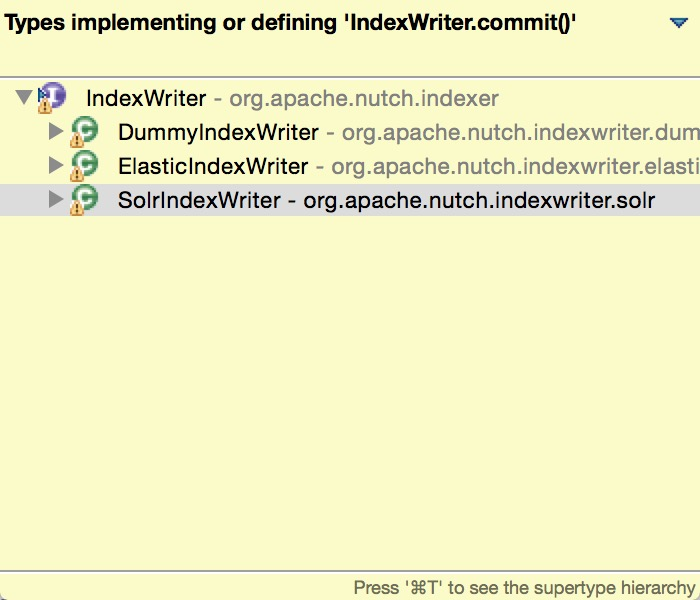

## Parse

Parse content in a segment。

### 脚本调用方法

	Usage: ParseSegment segment [-noFilter] [-noNormalize]
可见默认是Filter和Normalize的。


### 执行流程

 jobname(parse201501011234)\<segments/datedir/content,segment/datedir,ParseSegment.map,reduce,\<SequenceFileInputFormat,ParseOutputFormat>>


### 执行子流程
#### map
1. 判断改网页Meta信息里的抓取状态，不是success就跳过。  
2. 如果设置了skipTruncated，则跳过被truncated的网页。  
3. 用`ParseUtil`解析出`ParseResult`。
4. 对ParseResult出的每一个<Text,Parse>，执行下面的流程：
	1. 设置`Parse.Data.ContentMeta`的`nutch.segment.name`为`segmentname`。
	2. 计算签名，并设置`Parse.Data.ContentMeta`的`nutch.content.digest`为签名的`HexString`。
	3. 用`scfilters.passScoreAfterParsing`计算下分数。

输出 <url, ParseImpl implements Parse>。
#### reduce
collect <url, ParseImpl>，仅collect第一个值。然后在写文件的时候使用了ParseOutPutFormat，把ParseImpl里的值分别写入到`parse_text`,`parse_data`,`crawl_parse`三个目录里。
### 相关数据结构

#### ParseResult implements Iterable<Map.Entry<Text, Parse>> 
A utility class that stores result of a parse. Internally a ParseResult stores <Text, Parse> pairs.  
Parsers may return multiple results, which correspond to `parts or other associated documents` related to the original URL.
There will be usually one parse result that corresponds directly to the original URL, and possibly many (or none) results that correspond to derived URLs (or sub-URLs).  

#### ParseOutputFormat


## UpdateDB
一个segment抓取、解析完成后，更新该segment的内容到crawldb。类：`org.apache.nutch.crawl.CrawlDb`。
### 脚本调用方法

```
Usage: CrawlDb <crawldb> (-dir <segments> | <seg1> <seg2> ...) [-force] [-normalize] [-filter] [-noAdditions]
	crawldb	CrawlDb to update
	-dir segments	parent directory containing all segments to update from
	seg1 seg2 ...	list of segment names to update from
	-force	force update even if CrawlDb appears to be locked (CAUTION advised)
	-normalize	use URLNormalizer on urls in CrawlDb and segment (usually not needed)
	-filter	use URLFilters on urls in CrawlDb and segment
	-noAdditions	only update already existing URLs, don't add any newly discovered URLs

```


### 执行流程

 crawldbjob<CrawlDbFilter.map,CrawlDbReducer.reduce,Input:<segments/201501010101s/crawl_fetch,segments/2015010101s/crawl_parse,crawldb/current>,output:crawldb/random.nextInt>  
 CrawlDb.install(job, crawlDb); //Rename crawldb/current to crawldb/old,crawldb/random.nextInt to crawldb/current
### 执行子流程
#### CrawlDbFilter.map
规范化URL、过滤URL。输出<url, CrawlDatum>。
#### CrawlDbReducer.reduce
Merge new page entries with existing entries.  
从`crawldb/crawl_fetch/crawl_parse`三类目录下，进行merge。  
遍历values，得到`getFetchTime()`最近的fetchDatum和oldDatum，然后这两个CrawlDatum配合各种Fetch_Status得出最后的result（这个有点复杂，因为和CrawlDatum的各种Status相关，`switch(fetchDatum.getStatus())`）。


### 相关数据结构


## Deduplication on CrawlDb

Update db之后，对Crawldb中status为`fetched`的URL进行去重（按照`指纹`而不是URL）。  
Generic deduplicator which `groups fetched URLs` with the same `digest` and `marks` all of them as `duplicate` except `the one with the highest score` (based on the score in the crawldb, which is not necessarily the same as the score indexed). If two (or more) documents have the same score, then the document with the latest timestamp is kept. If the documents have the same timestamp then the one with the shortest URL is kept（如果URL长度又一样呢？哈哈，代码里这个情况没处理，也就是如果长度也一样，就把这2个实例当做不重复来对待了，继续留在crawldb里。我觉得应该就取第一个来的算了，第二个标记为STATUS_DB_DUPLICATE）. The documents marked as duplicate can then `be deleted` with the command `CleaningJob`.
### 脚本调用方法

```
Usage: DeduplicationJob <crawldb>

```


### 执行流程
DeduplicationJob<DBFilter.map, DedupReducer.reduce,input:crawldb.current,output:mapred.tmp.dir/dedup-job-randomInt>，其中`setMapOutputKeyClass(BytesWritable.class)`。  
MergeJob。替换了UpdateDB的crawldbjob的ReducerClass，`mergeJob.setReducerClass(StatusUpdateReducer.class)`。另外，Inputpath包含上一步的临时目录输出。

### 执行子流程
#### DbFilter.map

1. 判断URL是否是`STATUS_DB_FETCHED`和`STATUS_DB_NOTMODIFIED`两种状态中的一种。
2. 取得其signature，作为map输出的`key`。
3. 把CrawlDatum的MetaData里加上`_URLTEMPKEY_`属性存入当前URL（仅仅是在内存中，这个属性）。

#### DbFilter.reduce

按照类说明里的规则进行标记、去重，这里粘出来前两步示例：

```
 CrawlDatum newDoc = values.next();
                // compare based on score，existingDoc为同一个指纹的第一个URL文档
                if (existingDoc.getScore() < newDoc.getScore()) {
                    writeOutAsDuplicate(existingDoc, output, reporter);//status变为STATUS_DB_DUPLICATE
                    existingDoc = new CrawlDatum();
                    existingDoc.set(newDoc);
                    continue;
                } else if (existingDoc.getScore() > newDoc.getScore()) {
                    // mark new one as duplicate
                    writeOutAsDuplicate(newDoc, output, reporter);
                    continue;
                }
                // same score? delete the one which is oldest
                if (existingDoc.getFetchTime() > newDoc.getFetchTime()) {
                    // mark new one as duplicate
                    writeOutAsDuplicate(newDoc, output, reporter);
                    continue;
                } else if (existingDoc.getFetchTime() < newDoc.getFetchTime()) {
                    // mark existing one as duplicate
                    writeOutAsDuplicate(existingDoc, output, reporter);
                    existingDoc = new CrawlDatum();
                    existingDoc.set(newDoc);
                    continue;
                }
```
最后剩下的那个确定要留下的URL未做任何处理，直接被抛弃了（当然它还在crawldb里）。标记为`STATUS_DB_DUPLICATE`的URL删除`_URLTEMPKEY_`属性，进行输出，放入临时目录。

#### StatusUpdateReducer.reduce
MergeJob前面的Map和UPdateDB一样，后面的reduce不同。Reducer类注释稍有不同：

	Combine multiple new entries for a url.
这个很简单，就是对同一个URL的不同values，如果发现里面有`STATUS_DB_DUPLICATE`标记的实例，就输出它。如果没有，就输出最后一个value。（其实一个URL只会有2种情况，一种是只有一个来自crawldb的value，另一种是多了一个来自上一步临时目录的`STATUS_DB_DUPLICATE`的value）。

### 相关数据结构

## InvertLinks
org.apache.nutch.crawl.LinkDb.  
维护一个反转链接的Map，列出每一个URL的入链（inlinks）。

### 脚本调用方法


```
Usage: LinkDb <linkdb> (-dir <segmentsDir> | <seg1> <seg2> ...) [-force] [-noNormalize] [-noFilter]
	linkdb	output LinkDb to create or update
	-dir segmentsDir	parent directory of several segments, OR
	seg1 seg2 ...	 list of segment directories
	-force	force update even if LinkDb appears to be locked (CAUTION advised)
	-noNormalize	don't normalize link URLs
	-noFilter	don't apply URLFilters to link URLs

```
操作对象是日期命名的segment文件夹，或者是其父文件夹`segments文件夹`（`-dir`参数）。


### 执行流程
1. Invert
DbLinkJob<LinkDb.map, LinkDbMerger.combine, LinkDbMerger.reduce, <SequenceFileInputformat,MapFileOutputFormat>, Input:segment1,2.../parse_data, Output:linkdb-randomInt, Output<Text, Inlinks>,mapred.output.compress=true>。  
2. Try to Merge
Dblink-Merge-job<LinkDbFilter.map, LinkDbMerger.reduce, <SequenceFileInputformat,MapFileOutputFormat>, Input:linkdb-randomInt,Linkdb/current, Output:linkdb-merge-randomInt, Output<Text, Inlinks>,mapred.output.compress=true>
3. Install LinkDb
把第二步的output目录rename为Linkdb/current，原current目录rename为old，并删掉。


有一个小疑问：这一句的`newLinkDb`究竟是哪里？这是一个相对路径。
``` 
Path newLinkDb =
      new Path("linkdb-" +
               Integer.toString(new Random().nextInt(Integer.MAX_VALUE)));
```


 
### 执行子流程
#### LinkDb.map
规范化、过滤FromURL，然后针对每一个析出的OutLink，规范化、过滤，然后取出OutLink的anchor，`new Inlink(fromUrl, anchor)`，把这个Inlink加入Inlinks（它里面有个HashSet可以装多个Inlink，这里只装了一个），输出<OutLink, Inlinks> 。注意在处理OutLink的时候有个参数`db.ignore.internal.links`，如果为true，忽略`和fromUrl的host相同的OutLinks`
`。
#### LinkDbMerger.reduce
把上一步的输出的同一个OutLink的InLinks，汇集为一个InLinks并输出 <OutLink, Inlinks>，这里有个参数`db.max.inlinks`指定了一个OutLink的最大入度（InLinks的最大size）。

#### LinkDbFilter.map
对<OutLink,Inlinks> 里的OutLink和Inlink进行规范化、过滤，并输出。

### 相关数据结构

## SolrIndex
org.apache.nutch.indexer.IndexingJob.

### 脚本调用方法

```
Usage: Indexer <crawldb> [-linkdb <linkdb>] [-params k1=v1&k2=v2...] (<segment> ... | -dir <segments>) [-noCommit] [-deleteGone] [-filter] [-normalize]

```
通用Indexer，依赖于实现了IndexWriter接口的插件。

### 执行流程
1. IndexerJob\<IndexerMapReduce.map, IndexerMapReduce.reduce, <SequenceFileInputformat,IndexerOutputFormat>, Input:segment/crawl_fetch,segement/crawl_parse,segement/parse_text,segement/parse_data,crawldb/current,\[linkdb/current\]Output:tmp_randomInt\>.    
注意这里的Input是所有加入的segments目录。
2. 如果需要commit，则IndexWriter.commit()
3. delete outputdir.


### 执行子流程
#### IndexerMapReduce.map
过滤下URL，输出<Text(URL), NutchWritable(value)>.

#### IndexerMapReduce.reduce
对于每个URL，把能得到的数据都提取出来（InLinks，content，parseData，等等），在这个过程中对CrawlDatum的各种状态做了判断，对于某些状态的URL我们不做索引（比如Fetch失败的状态等），Nutch状态贯穿整个Nutch处理过程，是各模块处理的条件和依据。

```
if (value instanceof Inlinks) {
        inlinks = (Inlinks)value;
      } else if (value instanceof CrawlDatum) {
        final CrawlDatum datum = (CrawlDatum)value;
        if (CrawlDatum.hasDbStatus(datum)) {
          dbDatum = datum;
        }
        ......
```

新建一个`NutchDocument doc`，添加固有字段：

```
doc.add("id", key.toString());
doc.add("segment", metadata.get(Nutch.SEGMENT_NAME_KEY));
doc.add("digest", metadata.get(Nutch.SIGNATURE_KEY));//used by dedup
```

然后调用indexer插件增强此doc：

	doc = this.filters.filter(doc, parse, key, fetchDatum, inlinks);
调用评分插件评个分：

	boost = this.scfilters.indexerScore(key, doc, dbDatum,
              fetchDatum, parse, inlinks, boost);
    doc.add("boost", Float.toString(boost));

这样子输出：

    NutchIndexAction action = new NutchIndexAction(doc, NutchIndexAction.ADD);
    output.collect(key, action);
注意输出的value，包含了一个添加动作。上面如果遇到删除标记，还有删除动作：

	NutchIndexAction action = new NutchIndexAction(null,  
	    	NutchIndexAction.DELETE);
事实上这个Reduce并没有输出到HDFS文件，因为重写的IndexerOutPutFormat。	    	
### 相关数据结构
#### IndexerOutputFormat
在reduce之后的OutPut环节上，自定义了`RecordWriter`，在写Record的时候进行写Solr操作：

```
// 重写了RecordWriter的write方法，只有增加和删除2种操作：

 public void write(Text key, NutchIndexAction indexAction)
                    throws IOException {
                if (indexAction.action == NutchIndexAction.ADD) {
                //具体的write操作要看IndexWriter的插件，插件示例见下节
                    writers.write(indexAction.doc);
                } else if (indexAction.action == NutchIndexAction.DELETE) {
                    writers.delete(key.toString());
                }
            }

```

#### IndexWriter
上述MR结束后，结果写入临时目录，然后再调用IndexWriters插件们来commit。Nutch提供了3个默认插件，依次调用配置的插件。

一次把所有reducers的结果全commit了：

```
IndexWriters writers = new IndexWriters(getConf());
          if (!noCommit) {
                writers.open(job,"commit");
                writers.commit();
            }
```

我们以SolrIndexWriter为例：  
IndexerWriter的`open()`方法:

        SolrServer server = SolrUtils.getCommonsHttpSolrServer(job);
        init(server, job);//设置一些参数，如batchsize，solrMapping等
`write()`方法：
 
 ```
 public void write(NutchDocument doc) throws IOException {
        final SolrInputDocument inputDoc = new SolrInputDocument();
        for (final Entry<String, NutchField> e : doc) {
            //从NutchDocument填充好inputDoc
            ......
            }
        //把inputDoc加入类变量inputDocs里，如果inputDocs的size达到batchsize,
        //则提交
        if (inputDocs.size() + numDeletes >= batchSize) {
            UpdateRequest req = new UpdateRequest();
            req.add(inputDocs);
            req.setParams(params);
            req.process(solr); 
            inputDocs.clear();
            }
```
这里要注意下`Hadoop中RecordWriter`的生命周期和作用范围。
     

