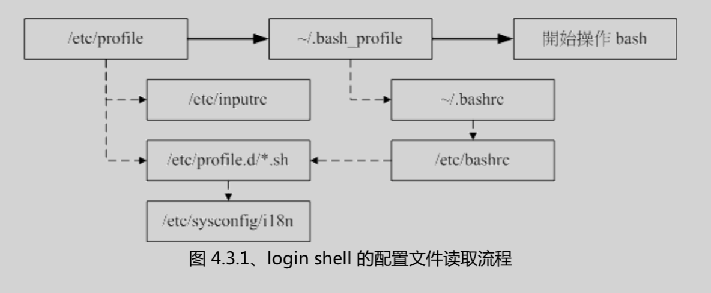

# Bash and Shell Scripts
---
## Shell and Bash
* echo -e 开启反斜杠转义。-E关闭反斜杠转义。
* `type command`显示command的类型，比`which `详细点。可用`type -a command`来查看所有叫这个名字的命令，我们直接输入command其实执行的是第一行的command。同名command优先顺序为：alias，shell buildin，PATH。
		
		lz@mac:~
		> type -a ls
		ls is an alias for ls -G
		ls is /bin/ls


* 执行命令：`` `指令` ``或者`$(指令)`返回指令的结果。
* 若该变量需要在其他子程序执行,则需要以export将其引为环境变量: `export PATH`.因为子程序（如你在bash里调用的bash）只会继承父程序的环境变量，父程序自身的变量其不会继承。
* `取消`变量为`unset varName`.
* 注意设定变量的时候等号两端不能有空格等！
* 变量var后面加abc字符串可以这么玩：`var=${var}abc`或者`var="$var"abc`。
* 输入`env`或者`export`可列出环境变量。
* 输入`set`列出除了环境变量，还有shell内的一些变量。比如`PS1`这个变量代表的就是提示符显示的内容格式设定。比如我的就是

		S1='
		%{$GREEN_BOLD%}%n@%m%{$WHITE%}:%{$YELLOW%}%~%u$(parse_git_dirty)
		$(git_prompt_ahead)%{$RESET_COLOR%}
		%{$BLUE%}>%{$RESET_COLOR%} '
因为包含了Git相关内容显示，所以显得复杂，显示出来就是：
`lz@mac:~/Documents/mddocs`
* `$`也是一个变量，代表的是当前shell的PID，所以可以`echo $$`显示PID。
* `?`变量代表上一个命令执行完后的返回值。正确则为0.`echo $?`
* read的`-t`指定过多少秒后就忽略输入继续往下走，如下：
		
		read -p '输入你的名字' -t 30 name
		echo $name
* declare 

```
# declare [-aixr] variable
选项参数:
-a :将后面名为 variable 的变量定义成为数组 (array) 类型
-i :将后面名为 variable 的变量定义成为整数数字 (integer) 类型
-x :用法和 export 一样,就是将后面的 variable 变成环境变量;
-r :将变量指定为 readonly 类型,该变量不能被改变，且不能 unset
example：
$sum=50+20+30
$echo $sum
$50+20+30  #默认变量是字符串类型的，所以需要：
declare -i sum=40+20+30 $sum的结果才是一个数。
```
* 数组赋值 

		var[1]="mike"(下标从1开始),var[2]="is",
		echo $var
		mike is
* ulimit 修改文件系统和bash的限制。重新注销再登入限制取消。`－a`查看.比如限制用户职能建立10M一下的文件：
		ulimit -f 10240
* 变量截取&变量字符串替换 从此可以愉快滴处理目录了！
		
		${var#模式}：去掉var变量里从开始到匹配到的第一个模式
		${var##模式}：去掉var变量里从开始到匹配到的最后一个模式
		模式中可以用通配符*，如${PATH##/*:}的结果是仅仅保留了PATH变量的最后一个目录。
		而如果只用一个井号则只删除第一个目录。

		从后往前删用%替换#即可。
		假设$dir保存的是当前的一个文件目录，那么我们取得它的父目录可以用${dir%/*}

		变量替换：${var/old/new}替换第一个出现的old为new
		${var//old/new}替换所有出现
* 变量设定 经常遇到，挺有用！设定默认值
		
		var=${old_var-defaultvalue} 如果old_var变量未设定（不包括已被设定为空字符串），则var会设定为defaultvalue，否则var会被设定为old_var的值
		var=${old_var:-defaultvalue} 如果old_var变量未设定或者为空字符串，则var会设定为defaultvalue，否则var会被设定为old_var的值
		现在看来第二个:-用处比较大啊！！
		其他还有一些比较怪异的设定。。
* alias & unalias &nbsp;&nbsp;取消别名
* 命令历史 `history`。如何执行历史命令？history命令显示历史命令及编号，输入`!编号`选出编号处的命令。输入`!命令前缀`将选出历史最近的以此为前缀的命令。
* 进站画面，登录时显示的欢迎内容。设置在`/etc/issue`。`/etc/issue.net`是telnet登录时候的进站画面。登录后显示的欢迎内容放在`/etc/motd`里。
* login shell和non-login shell:
	* login: 由tty1-6登入，需要输入用户名和密码。
	* non-login: 在X－window启动的终端，或者在shell里输入`bash`等登录进去的shell。  
* 这两种登录方式读取的配置文件不同。  
login shell 读取顺序是：
		
		/etc/profile, ~/.bash_profile或者~/.bash_login或者~/.profile
		！注意：上面的2个“或者”如果前一个存在就不读第二个了！
		其中/etc/profile还会载入/etc/profile.d/*.sh，所以推荐把要加载的内容放在这里！
	
non-login shell只读取`~/.bashrc`（如果用的是bash的情况下），有时候你敲一个`bash`会发现很丑的提示符，那是因为.bashrc没有把PS1变量设置好。不影响太多使用。
* ~/.bash_logout 记录当我注销bash后，系统再帮我做什么工作后离开。
* shell可以用类似正则来匹配，如`/etc/[^a-z]* `。
* 数据流重定向可以把标准输出和标准错误输出分开，而不是都显示在屏幕上。
	
		1. 标准输入 (stdin):代码为0,使用<或<<;
		2. 标准输出 (stdout):代码为1,使用>或>>; 
		3. 标准错误输出(stderr):代码为2,使用2>或2>>;
其实我们平时用的`>`默认解释为`1>`。所以下面的指令：`./a.sh 1> stdout.log 2> stderr.log`的意思是把a.sh执行的标准输出输出到stdout.log里，如果出错，错误信息输出到stderr.log里。  
如果我们要把正确、错误信息都输出到一个文件里怎么办呢？下面有2种方法请体会：

		./a.sh > list 2>&1 注意2>后面没有空格。 
		./a.sh &> list
* `<`的意思是原本用键盘输入的内容由读取文件的方式替代，如`echo < a.txt`，需要输入ctrl＋d来结束输入。而`<<`则是指定输入关键字。

		cat > catfile << "eof"
		> This is a test.
		> OK now stop
		> eof <==输入这关键词,立刻就结束而不需要输入 [ctrl]+d

* 记得还有一个空设备`/dev/null`用来丢弃东西。
	
* ; && || 这3个，第一个是可以一行内连续执行多个指令，如`ls;shutdown -h now`。第二个如果前面的指令执行成功（返回0）则执行第二个指令，不成功则不执行第二个。第三个同理。***发现bash里这些操作符的结合是从左往右的，暂时未发现小括号的结合性***

* 管道命令`|`只能将上一级的stdout传给下一级，而stderr则无法传过来。另外后一个命令必须可以接受前一个命令的输出作为输入才行。

### 一些shell常用命令

* cut

`echo $PATH | cut -d ':' -f 3,5`：取出PATH变量的第3、5个路径。 cut：***对每行操作***，`-d`指定分隔符，注意分割时连续分隔符并不会当作一个分隔符，`-f 数字`指定取出分割后的第几列。`cut -c 数字`代表取出第几个字符，`-c 数字-`指从第几个字符之后的所有字符，`-c 数字－数字`指从第几个字符到第几个字符。

* grep ：最后可跟多个文件哦～

		[root@www ~]# grep [-acinv] [--color=auto] '搜寻字符串' filename 
		参数:
		-a :将 binary 档案以 text 档案方式搜寻数据
		-c :计算'搜寻字符串' 出现次数
		-i :忽略大小写
		-n :输出行号
		-v :反向选择,亦即显示出没有 '搜寻字符串' 内容的行! 
		--color=auto :高亮显示搜索串!
* sort
		
		[root@www ~]# sort [-fbMnrtuk] [file or stdin] 
		参数:
		-f :忽略大小写;
		-b :忽略前面的空格部分；
		-n :当成数字排序(默认排序是文本排序，10会排在2前面的);
		-r :反向排序;
		-u :就是 uniq ,相同数据中,仅出现一行代表; 
		-t :分隔符，默认 [tab];
		-k :以分割后的第几个字段排序。这个配和-t好!

* uniq 将***连续相同***的行只取一个，所以统计前一半先sort一下！

		root@www ~]# uniq [-ic] 
		参数:
		-i :忽略大小写; 
		-c :计数，并放到第一列
* tee 双重定向，可以在重定向的时候输出一份内容到文件

		[root@www ~]# tee [-a] file
		参数:
		-a :追加到file，默认是覆盖。
		[root@www ~]# last | tee last.list | cut -d " " -f1
		＃在用cut处理的同时，输出一份到last.list
* tr 删除或者替换文字中的文本

		[root@www ~]# tr [-ds] SET1 ... 
		参数:
		-d :删除文本中出现的 SET1 字符串; 
		-s :取代重复的字符!?
		#将 last 输出讯息中,所有小写变大写:
		[root@www ~]# last | tr '[a-z]' '[A-Z]'
		＃删除冒号： 
		[root@www ~]# cat /etc/passwd | tr -d ':'
		将 /etc/passwd 转存成 dos 格式到/root/passwd 中,再将 ^M 符号去除（就是DOS换行会显示的），有用！！
		[root@www ~]# cp /etc/passwd /root/passwd && unix2dos /root/passwd 
		/root/passwd: ASCII text, with CRLF line terminators <==就是 DOS 换行符\r\n 
		[root@www ~]# cat /root/passwd | tr -d '\r' > /root/passwd.linux
* col

		[root@www ~]# col [-xb]
		参数:
		-x :将 tab 键转换成空格键(有时候显示的^I这个符号)！
		-b :在文字内有反斜杠 (\) 时,仅保留反斜杠最后接的那个字符，也就是把其转存为纯文本。可以把显示的很怪异的`N^HNA^HAM^HME^HE`之类显示成`NAME`,注意其中^H是一个转义字符！

* join paste expand(tab转空格) 等。。。

* split 分割文件，当然，也可以分割标准输入（这个只能按行了吧？）
		
		[root@www ~]# split [-bl] file PREFIX
		参数:
		-b :分割大小,可加单位,例如 b, k, m 等; 
		-l :以行数分割。
		PREFIX :分割后文件的前缀。
		#split -b 300k /etc/termcap termcap
		怎么合并？
		# cat termcap* >> termcapback
		把ll显示的内容按3行一个文件的方式存入llfile为前缀的文件中，注意那个 "-"代表标准输入/输出
		#ll|split -l 3 - llfile

* xargs 这个很有用！把stdin的数据读入（以空格和换行分割！经查tab键也可以。。），变成一组组参数传给后面的命令，对于非管线命令很有用！比如ls -l这种。可以`前面的stdin数据|xargs ls -l`

		[root@www ~]# xargs [-0epn] command
		参数:
		-0 :如果输入的stdin有特殊字符,例如 `, \, 空格键等等字符时（屏蔽了空格就只能用换行作分隔符了？）,这个 -0 参数可以将他还原成一般字符。也就是屏蔽前面的转义!
		-e :这个是 EOF (end of file)的意思。后面可以接一个字符串,当 xargs 的输入遇到这个字符串时,就会停止继续工作!-e和停止字符串之间没有空格。
		-p :在执行每个指令的argument 时,都会询问使用者;
		-n :后面接次数,每次 command 命令执行时,要消耗几个参数。

		 $cat /etc/passwd|grep -v '#'|cut -d':' -f 1  |head -n3|xargs -n 2 echo
		nobody root
		daemon
		最后把 三个参数分成2个一组依次传给echo

* `-`的用途。在管线命令当中,常常会使用前一个指令的stdout 作为这次的stdin , 某些指令需要用到文件名来处理时 (例如 tar) ,该 stdin 到 stdout 可以用减号 "-" 替代:
		

		[root@www ~]# tar -cvf - /home | tar -xvf -

		将 /home 里面的文件打包,但打包的数据不是放到文件里,而是传送给dstdout; 经过管线后,将 tar -cvf - /home 传送给后面的 tar -xvf -。中途就不需要临时的file了！
* 本章小结题摘

		如何秀出 /bin 底下,文件名为四个字符的文件?
		#ls -l /bin/????

### 正则表达式

* vi, grep, awk ,sed 等等工具是支持正则的，但是cp、ls等指令不支持，只能使用bash的通配符功能。

* 来，我们去除空行和以`#`开始的行：

		[root@www ~]# grep -v '^$' /etc/syslog.conf | grep -v '^#'

* 而在shell的正则里`|`是属于扩展正则（还有`+?()`等），需要用`grep -E`或者`egrep`才能使用。同样功能：

		[root@www ~]# egrep -v '^$|^#' /etc/syslog.conf

#### 一些重要的工具，以后详述！！！***awk***, diff, cmp, patch, printf, ***sed***.
## Shell Scripts

		#!/bin/sh
		#建议在脚本开始将一些PATH和环境变量设置好，这样就可以直接调用了！

* exit 0 :还记得那个`$?`吗？我们在脚本最后可以用`exit n`的方式来告诉系统我们的返回值！
* 还记得我们用`declare -i var=9*9`来定义一个数值类型的变量吗？我们也可以用这种方法来求表达式的值哦：

		a=9
		b=9
		total=$(($a*$b)) #用两个括号的，求变量值

* 脚本的执行环境：如果脚本直接执行，或者用`sh xx.sh`的方式执行，则脚本是另起一个子程序的，其里面如果包含export这里设置环境变量的指令，在程序执行完后是不会设置到当前环境的。但是`source xx.sh`这个指令是在***当前环境***中执行脚本！
* test 测试指令。不会显示什么，但是返回值（$?）会有值，可以作为后面程序分支条件！可以测试一些文件、文件属性相关内容。

		test -e /路径	＃该文件（目录）是否存在
		test -e /路径 && echo 'exist' || echo 'not exist'
		test -e /路径 ;echo $?
		test的其他参数：
		-f /路径	＃该路径是否存在且为文件
		-d /路径	#该路径是否存在且为目录
		-x /路径	＃该路径是否存在且可执行
		test file1 -nt file2	#file1是否newer than file2，类似有 -ot(older than)
		test n1 -eq n2 #判定整数n1是否和n2相等。类似有 -ne(not equal), -gt(greater than), -lt(less than), -ge(greater equal), -le(less equal)
		#字符串测试
		test -z $xx	#判断xx变量是否为空字符串或者未定义，如果是则返回true（0）
		test $xx	#与上面相反
		test $xx = $yy
		test $xx != $yy
		#多重判定(-a and;-o or;! not)
		test -r file1 -a -x file1	#当file1是可读的并且可执行的才返回true
		test ! -x file1 #当file1不可执行时返回true
这个test命令在***root账户***下test权限部分有的地方会无效，因为root账户的权限太高。建议在普通用户下测试。
* [] 一个更简洁、有用的测试（***条件判别式***）！  
下面判断`$HOME`变量是否为空：

		[ -z "$HOME" ] ; echo $?
必须要注意，因为中括号还用在正则和通配符等其他地方，所以用作判断时注意***中括号内部的两端需要有一个空格***，下面的方块是需要的空格。这里用两个等号来代表`比较是否相等`（shell里一个等号也可以比较，但是用2个更清晰些）,注意两个等号两边也需要有空格！

		[□"$HOME"□==□"$MAIL"□]
	有以下原则：
>* 中括号[]内的每个组件都要用空格分割
>* 里面的变量最好用**双引号**括起来
>* 里面的常量最好用单引号或者双引号括起来
* script中的输入参数
		
		#./scriptName.sh	opt1	opt2	opt3	opt4
		#$0					$1		$2		$3		$4
		注意$0是“./scriptName.sh”
		还有一些magic变量：
		$# :代表参数个数，如上面就是4
		$@ :代表『 "$1" "$2" "$3" "$4" 』，每个变量是独立的(用双引号括起来);
		$* :代表『 "$1c$2c$3c$4" 』,其中 c 为分隔符,默认为空格键, 所以本例中代表『 "$1
		$2 $3 $4" 』。

		还有个指令： shift ，代表把最左边的参数移除

		可以单独shift（左移一次，移除最左边的参数），或者shift n。n代表左移个数。感觉没啥用，他的功能用其他的命令基本都能实现。

* if
		
		!!!Important New!!!:
		判断数字是否相等，用 -eq -ne 等  
		判断字符串是否相等，要用 =  
		尽量使用双中括号！单中括号会出现当字符串为空时，语法错误，需要用${a}'x' = ${b}'x' 这种来纠正。
		当字符串变量中可能包含空格时，需要用双引号括起来： "${a}" = "${b}"
		
		
		
		
		
		
		if [ 条件判别式 ]; then

		fi

		中括号里为上面说的中括号测试，当然可以有多个中括号，两个中括号间用逻辑&&||来组合。

		if [ "$yn" == "Y" ] || [ "$yn" == "y" ]; then

		fi

		# 多个条件刞断 (if ... elif ... elif ... else) 
		if [ 条件一 ]; then
			当条件一成立时,可以进行的指令工作内容; 
		elif [ 条件二 ]; then
			当条件二成立时,可以进行的指令工作内容;
		else
			当条件一、二均不成立时,可以进行的指令工作内容;
		fi
* case esac：`case in`，注意双引号，小括号，两个分号，最后的星号！这是在判断第一个参数`$1`。

		case $1 in 
		"hello")
			echo "Hello, how are you ?"
			;; 
		"")
			echo "You MUST input parameters, ex> {$0 someword}"
			;;
		*) # 其实就相当亍通配符,default那个!
			echo "Usage $0 {hello}"
			;; 
		esac

* function 函数。函数必须在调用它的代码前面；函数也有内置参数，`$0`代表函数名，`$1`代表第一个参数以此类推。。。

		funciton fname() {
			程序段
		}

		调用：

		fname 参数1 参数2

* 循环: 3种情况

		#while
		while [ condition ]
		do
		
		done
		
		# 直到满足condition停止
		until [ condition ]
		do
		
		done
		
		#for ，这个就是各个语言很通用的一个遍历了
		for animal in dog cat elephant 
		do
		echo "There are ${animal}s.... " 
		done

		users=$(cut -d ':' -f1 /etc/passwd) # get账号名称
		for username in $users # 开始循环
		do
		id $username
		finger $username
		done

		for num in $(seq 1 100)

		# 数值型的for，和java等类似的

		for (( i=1; i<=$nu; i=i+1 )) #注意外面的两个小括号
		do
			s=$(($s+$i)) 
		done
* 脚本调试 debug 

		[root@www ~]# sh [-nvx] scripts.sh
		参数:
		-n :不执行脚本仅查询语法是否有问题;
		-v :执行 sccript 前,先将 scripts 的内容输出刡屏幕上;
		-x :调试脚本,这是很有用的参数!会显示脚本执行步骤，并把变量值显示出来。 
